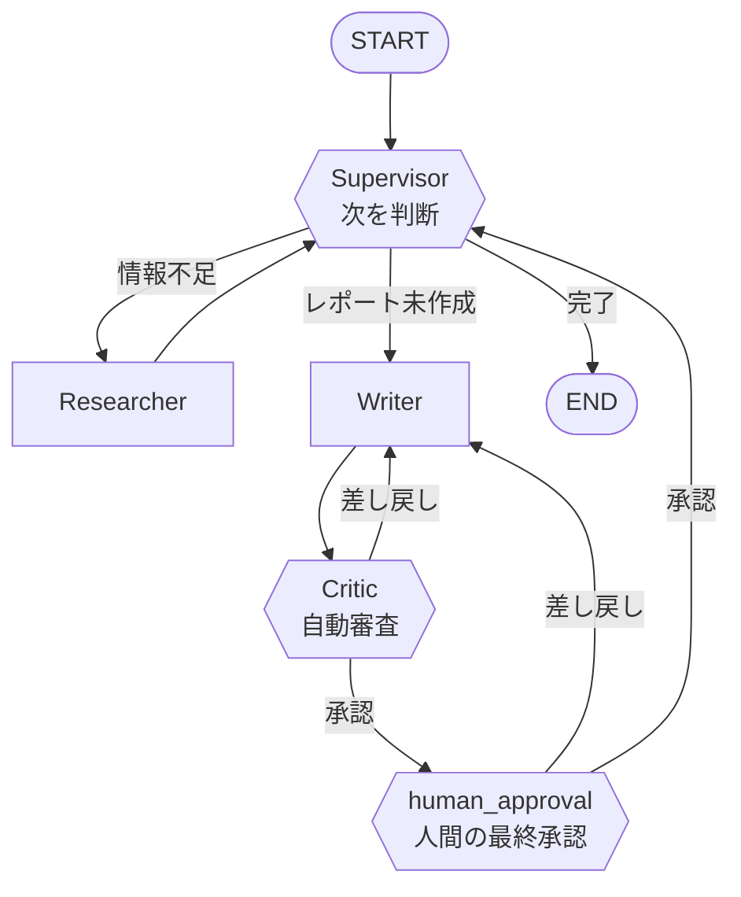

# ハンズオン: LangChain / LangGraphで作るマルチAIエージェント

**テーマ: リサーチ&レポート作成マルチエージェント**

Web検索で情報を集め(Researcher)、レポートを執筆し(Writer)、品質を審査し(Critic)、
最終的に人間が承認する(Human-in-the-loop)——という一連の作業を、複数のAIエージェントが
協調して行うシステムを、5ステップに分けて少しずつ作り上げます。

## 完成形の構成図



## ステップ一覧

| ステップ | ファイル | 追加される機能 |
|---|---|---|
| 1 | `step1_single_agent.py` | 単一エージェント + 検索ツール(LangGraphの基本: State/Node/条件分岐) |
| 2 | `step2_supervisor.py` | Supervisorによる複数エージェント(Researcher/Writer)への振り分け |
| 3 | `step3_memory.py` | Checkpointerによる会話の永続化(複数ターンのやり取り) |
| 4 | `step4_critic_loop.py` | Criticエージェントによる自己修正ループ(品質チェック&差し戻し) |
| 5 | `step5_human_in_the_loop.py` | `interrupt()`による人間の最終承認フロー(完成形) |

各ファイルは前のステップのコードをベースに機能を1つずつ追加しているので、
差分を見比べながら読むと理解しやすいです。

各Stepで何が起きているかの詳しい解説(図解 + 参照すべき公式ドキュメントへのリンク)は
[TUTORIAL.md](./TUTORIAL.md) にまとめています。コードを読んで分からない部分があれば、
まずそちらを参照してください。

## セットアップ

LLMはローカルのOllama(qwen3:8b)を使う構成になっています(Anthropic APIの
利用上限を回避するため、クラウドAPIからローカル実行に切り替え済み)。学習目的で
体感速度を優先し、比較的軽量な8Bモデルを採用しています(大きめの`qwen3:30b`等に
差し替えることも可能です。トレードオフは後述)。

```bash
# 1. Ollamaをインストール(Mac、Dockerなし)
brew install ollama
brew services start ollama   # または `ollama serve` で手動起動

# 2. モデルを取得(5GB程度)
ollama pull qwen3:8b

# 3. Python依存パッケージ
pip install -r requirements.txt
cp .env.example .env
# .env を開いて TAVILY_API_KEY を設定(ANTHROPIC_API_KEYは不要になりました)
```

- `TAVILY_API_KEY`: https://tavily.com/ (検索用。無料枠あり)
- `ANTHROPIC_API_KEY`: 現在は未使用。`exercises/step1_ex2_tool_choice.py`
  (tool_choiceの強制/禁止を確認する課題)だけはOllamaがtool_choiceを
  サポートしていないため、この課題に限りAnthropicへ戻すと挙動を確認しやすいです。
  https://console.anthropic.com/

### ローカルLLM利用時の注意: 日付を知らない問題

Ollamaで動くローカルLLMは学習データの時点までの知識しか持たず、「今日が何日か」を
知りません。何も伝えないと「今は学習データが作られた頃の年だ」と思い込み、
本来は検索すべき最新情報の質問でも、自分の(古い)知識だけで誤って回答してしまう
ことがあります。

この対策として、各Stepのソースコードでは `date.today()` で取得した実際の日付を
システムプロンプトに明示的に埋め込み、「日付が絡む質問は自分の知識を過信せず検索する」
よう指示しています(`SYSTEM_PROMPT` / `TODAY_NOTE` という名前の定数)。
詳細は [TUTORIAL.md](./TUTORIAL.md) の「ローカルLLM(Ollama)移行と落とし穴」を参照してください。

## 実行方法

```bash
python step1_single_agent.py
python step2_supervisor.py
python step3_memory.py
python step4_critic_loop.py
python step5_human_in_the_loop.py   # 実行中にターミナルで y/n の入力を求められます
```

## 各ステップで学ぶLangGraphの概念

1. **Step1**: `StateGraph` / `add_messages` / `ToolNode` / `tools_condition` ——
   最小構成のReActエージェントを自分で組み立てる。
2. **Step2**: Supervisorパターン(構造化出力によるルーティング)/ `create_react_agent`(prebuilt) ——
   役割分担によるマルチエージェント化。
3. **Step3**: `MemorySaver` / `thread_id` ——
   グラフの実行をまたいで状態を保持する。
4. **Step4**: 条件分岐によるループ / 上限回数によるガード ——
   エージェントの自己修正(reflection)を安全に実装する。
5. **Step5**: `interrupt()` / `Command(resume=...)` ——
   人間の判断を組み込んだHuman-in-the-Loopフロー。

## この先の発展アイデア

- `astream_events` でトークン単位のストリーミング表示を追加する
- LangSmithでトレースを可視化し、各エージェントの動作をデバッグする
- Researcherを並列実行(複数トピックを同時調査)してMap-Reduce的に統合する
- SqliteSaver/PostgresSaverに差し替えて本番運用可能な永続化にする
- Writerの出力をMarkdown/Wordファイルとして自動保存する
