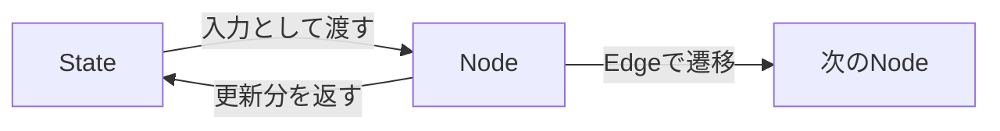
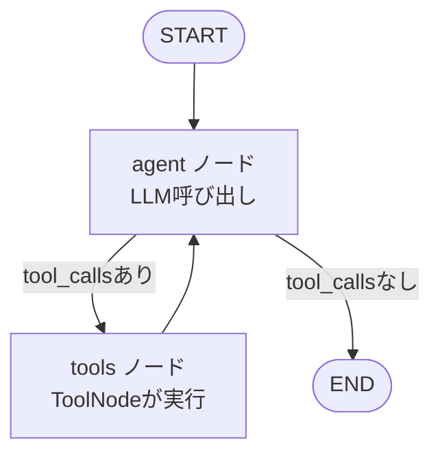
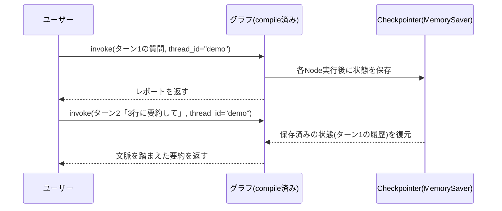
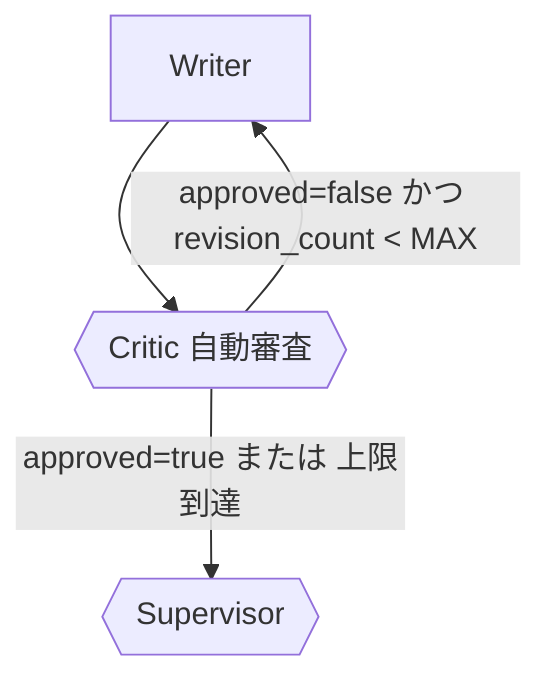
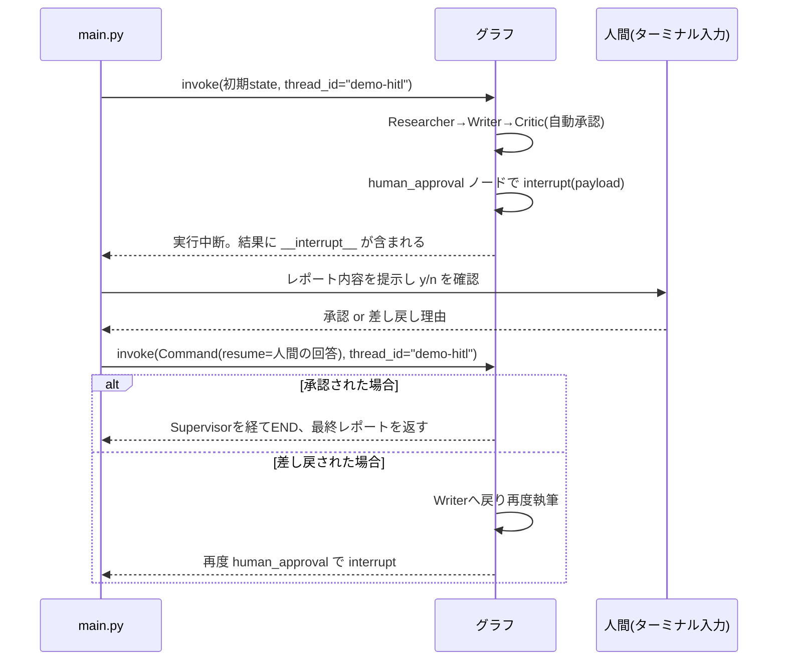

# TUTORIAL: 各Stepの解説

このドキュメントの目的は「動くコードを写経する」ことではなく、**各Stepで何が起きているかを理解し、
自分で公式ドキュメントを調べながら機能を拡張できるようになる**ことです。

各Stepの解説には、対応する公式ドキュメント(LangChain / LangGraph)へのリンクを載せています。
コードを読んで分からない部分があれば、まずそのリンク先を読みに行く癖をつけてください。

> 補足: LangChainのドキュメントは2025年に `docs.langchain.com` に統合されました。
> API仕様の詳細(引数・戻り値など)は `reference.langchain.com` にあるリファレンスを見るのが確実です。
> 概念や使い方のガイドは `docs.langchain.com`、関数/クラスの厳密な仕様は `reference.langchain.com`、
> と使い分けると調べ物が早くなります。

## ドキュメントの読み方(全Step共通)

| 知りたいこと | 見るべき場所 |
|---|---|
| LangGraphの基本概念(State/Node/Edge)を知りたい | [Graph API overview](https://docs.langchain.com/oss/python/langgraph/graph-api) |
| はじめの一歩を動かしたい | [LangGraph Quickstart](https://docs.langchain.com/oss/python/langgraph/quickstart) |
| `StateGraph`のメソッド一覧・引数を確認したい | [StateGraph リファレンス](https://reference.langchain.com/python/langgraph/graph/state/StateGraph) |
| 特定のクラス/関数の正確なシグネチャを調べたい | [LangChain Reference (reference.langchain.com)](https://reference.langchain.com/python/langgraph) |
| ソースコードを直接読みたい/Issueを検索したい | [langchain-ai/langgraph (GitHub)](https://github.com/langchain-ai/langgraph) |

---

## 共通概念: State / Node / Edge

LangGraphは全てのアプリケーションを「グラフ」としてモデル化します。

- **State**: グラフ全体で共有されるデータ構造。各Nodeはこれを受け取り、更新分を返す。
- **Node**: 実際の処理を行う関数(LLM呼び出し、ツール実行など)。
- **Edge**: Node間の遷移。固定の遷移と、条件によって行き先が変わる`条件付きEdge`がある。

参考: [Graph API overview](https://docs.langchain.com/oss/python/langgraph/graph-api)



---

## Step1: 単一エージェント + 検索ツール

**ファイル**: `step1_single_agent.py`

### 何をしているか

1. `State`を定義する。ここでは`messages`(会話履歴)だけを持つ最小構成。
   `Annotated[list, add_messages]`という書き方で、「新しいメッセージは上書きではなく追記する」
   という集約ルール(reducer)を指定している。
2. `llm.bind_tools(tools)`で、LLMが「検索ツールを呼び出す」という意思表示(tool_calls)を
   返せるようにする。
3. `agent`ノードはLLMを呼び出すだけ。ツールを呼ぶかどうかの判断はLLM自身が行う。
4. `tools_condition`という補助関数が、直前のAIメッセージに`tool_calls`が含まれているかを見て、
   「ツールノードに進むか」「終了するか」を自動判定する。
5. ツール実行後は必ず`agent`ノードに戻り、LLMがツールの結果を踏まえて次の応答を作る。

### グラフ構成



### 「ツールを使うか」を判断しているのは誰か

誤解しやすいポイントとして、**LangGraphが回答の中身を評価してツール呼び出しを決めているわけではありません**。
判断の主体はあくまでLLM(Claude)自身で、LangGraph側はその判断結果を機械的に読み取っているだけです。

判断が実際に発生する場所はコード上2箇所に分かれています。

```python
llm = ChatOllama(model="qwen3:30b", temperature=0)
llm_with_tools = llm.bind_tools(tools)          # ① ツールの存在をLLMに知らせる(設定のみ)

def agent_node(state: State) -> State:
    response = llm_with_tools.invoke(state["messages"])   # ② 実際に判断が行われる瞬間
    return {"messages": [response]}
```

- **① `bind_tools(tools)`**: 「このLLMはこのツール一式を使ってよい」と権限を与える設定。
  LLMへのリクエストに`tools`パラメータ(各ツールの名前・説明・引数スキーマ)が
  付与されるようになるだけで、この時点ではまだ判断は発生していない。
- **② `llm_with_tools.invoke(...)`**: `agent`ノードが実行されるたびに呼ばれる、実際のLLM呼び出し。
  ツール定義付きのリクエストを受け取ったモデルが、会話履歴を見て「ツールを呼ぶべきか、
  このままテキストで答えるべきか」を毎回自動的に判断する。これはtool use機能自体の
  挙動であり、コード側に「判断してください」という明示的なプロンプト文は存在しない
  (ただしローカルモデルはこの判断を誤りやすい。詳細は本ドキュメント末尾の
  「ローカルLLM(Ollama)移行と落とし穴」を参照)。

判断結果は`response.tool_calls`というフィールドに格納されて返ってくる。
`tools_condition`はこの`tool_calls`が空かどうかを見ているだけの**機械的な分岐**であり、
回答の正しさや品質を審査しているわけではない(品質チェックはStep4で登場するCriticの役割)。

### 何が起きているかを言葉で追うと

「質問を受け取る → LLMが『検索が必要』と判断しtool_callsを返す →
`tools_condition`が検索ツールを実行すべきと判定 → `ToolNode`が実際に検索APIを呼ぶ →
検索結果を含めて再度LLMを呼び出す → 十分な情報が揃ったのでtool_callsなしの最終回答を返す →
`tools_condition`がENDと判定して終了」というループです。

### このStepで参照すべきドキュメント

- [LangGraph Quickstart(ツール付きエージェントの作り方)](https://docs.langchain.com/oss/python/langgraph/quickstart)
- [Graph API overview](https://docs.langchain.com/oss/python/langgraph/graph-api)
- [StateGraph リファレンス](https://reference.langchain.com/python/langgraph/graph/state/StateGraph)
- [`tools_condition` リファレンス](https://reference.langchain.com/python/langgraph.prebuilt/tool_node/tools_condition)
- [`ChatAnthropic`(Claudeモデルの使い方)](https://docs.langchain.com/oss/python/integrations/chat/anthropic)

### 自分で調べて拡張してみる課題

- ツールを2つ以上(検索 + 計算など)にしたらグラフはどう変わるか、`ToolNode`のドキュメントで
  複数ツール時の挙動を確認してみる。
  → 実際に手を動かす課題: [`exercises/step1_ex1_calculator_tool.py`](./exercises/step1_ex1_calculator_tool.py)
- `bind_tools`の代わりに`tool_choice`を指定すると何が変わるか調べてみる。
  → 実際に手を動かす課題: [`exercises/step1_ex2_tool_choice.py`](./exercises/step1_ex2_tool_choice.py)

---

## Step2: Supervisorパターンでマルチエージェント化

**ファイル**: `step2_supervisor.py`

### 何をしているか

Step1では1つのエージェントが全部をこなしていましたが、Step2では役割を分割します。

- **Researcher**: 検索専門。Step1と同じReAct構成を`create_react_agent`という prebuilt 関数で
  再利用している(自分でグラフを書かなくても同等のものが手に入る)。
- **Writer**: ツールを持たず、会話履歴にある情報をもとにレポートを書くことに専念する。
- **Supervisor**: 「次にResearcherを動かすか、Writerを動かすか、それとも終了か」を
  **毎ターン判断する**ノード。判断結果は`with_structured_output(RouteDecision)`によって
  `Literal["Researcher", "Writer", "FINISH"]`という機械可読な形で返される。

自由文でLLMに「次は誰?」と聞くと表記ゆれで分岐が壊れやすいため、Pydanticモデルで
出力形式を固定しているのがポイントです。

### グラフ構成


### 1回の実行で実際に起きている処理の流れ

1. ユーザーの依頼(例:「〇〇についてレポートを作って」)が`messages`としてグラフに渡り、
   最初に`supervisor`ノードが実行される。
2. Supervisorは会話履歴全体を見て、「まだ情報が無いのでResearcherが必要」と判断し、
   `next="Researcher"`を返す。
3. 条件付きEdge(`add_conditional_edges`)がこの`next`の値を見て`Researcher`ノードへ遷移する。
4. `Researcher`ノードは内部で`create_react_agent`(検索ツール付きのReActループ)を実行し、
   検索結果を要約した内容を`[Researcher] ...`という形でメッセージ履歴に追記する。
5. 処理は再び`supervisor`ノードに戻る(`Researcher -> supervisor`のEdge)。Supervisorは
   今度は会話履歴に十分な情報があると判断し、`next="Writer"`を返す。
6. `Writer`ノードが会話履歴(リサーチ結果)をもとにレポート本文を生成し、
   `[Writer] ...`として追記する。
7. 再度`supervisor`に戻り、レポートが揃ったと判断すれば`next="FINISH"`を返す。
8. 条件付きEdgeが`FINISH`を`END`にマッピングしているため、グラフの実行はここで終了し、
   最後に追記されたWriterのレポートが最終出力として返る。

つまりStep2は「Supervisorが状況を見て次の担当を選び、担当が作業して結果を履歴に積み、
またSupervisorに戻って次を判断する」というループを、Supervisorが`FINISH`と判断するまで
繰り返す構造です。ステップ数の上限は`graph.invoke(..., {"recursion_limit": 25})`のように
`recursion_limit`で制御しており、万一Supervisorが`FINISH`を出さない場合の暴走を防いでいます。

### SUPERVISOR_PROMPTが定義しているもの

`supervisor_node`の中で使われている`SUPERVISOR_PROMPT`は、Supervisorノードの中でLLMに
下させる**判断基準**を定義しています。

```python
SUPERVISOR_PROMPT = f"""あなたはリサーチ&レポート作成チームの管理者です。
以下のメンバーと会話しながら、次にどのメンバーを動かすか判断してください。
メンバー: {MEMBERS}

判断基準:
- まだ十分な情報が集まっていない場合は Researcher
- 情報は揃っていてレポートがまだ無い/不十分な場合は Writer
- レポートが完成し、これ以上作業が不要な場合は FINISH
"""

def supervisor_node(state: State) -> State:
    messages = [("system", SUPERVISOR_PROMPT)] + state["messages"]
    decision = llm.with_structured_output(RouteDecision).invoke(messages)
    return {"next": decision.next}
```

`supervisor_node`が実行されるたびに、`SUPERVISOR_PROMPT`が**systemメッセージ**として
その時点の会話履歴の先頭に付け加えられ、LLMに渡されます。LLMはこの判断基準に従って
`Researcher`/`Writer`/`FINISH`のいずれかを選び、`with_structured_output(RouteDecision)`に
よってその選択が`next`フィールドに構造化された形で返されます。

ここで役割分担を切り分けて理解しておくと後のStepでも応用しやすくなります。

- **判断の中身(何を選ぶか)**: `SUPERVISOR_PROMPT`とLLM自身が担当。プロンプトの
  「判断基準」の書き方次第で、Supervisorの振る舞い(何を優先するか)は変えられる。
- **判断結果の実行(どこへ遷移するか)**: LLMではなく、LangGraph側の`add_conditional_edges`
  が担当。

```python
graph_builder.add_conditional_edges(
    "supervisor",
    lambda state: state["next"],
    {"Researcher": "Researcher", "Writer": "Writer", "FINISH": END},
)
```

これはStep1で見た「LLMがtool_callsを出すかどうかを判断し、`tools_condition`がそれを
機械的に読み取ってルーティングする」という構造と全く同じパターンです。**「何を選ぶか」を
決めるのはプロンプト+LLM、「選ばれた結果をどう扱うか」を決めるのはグラフのEdge定義**、
という役割分担はLangGraphのほぼ全ての条件分岐に共通する考え方だと理解しておくと、
Step4のCriticやStep5のhuman_approvalを読むときも迷わなくなります。

### このStepで参照すべきドキュメント

- [Multi-agent: サブエージェント構成の作り方](https://docs.langchain.com/oss/python/langchain/multi-agent/subagents-personal-assistant)
- [LangGraph Multi-Agent Supervisor(ライブラリ版supervisor)](https://reference.langchain.com/python/langgraph-supervisor)
- [`create_react_agent`(prebuiltなReActエージェント)](https://reference.langchain.com/python/langgraph.prebuilt/chat_agent_executor/create_react_agent)
- [`with_structured_output`(Claudeでの構造化出力)](https://reference.langchain.com/python/langchain-anthropic/chat_models/ChatAnthropic/with_structured_output)

> **注意(API変化について)**: `langgraph.prebuilt.create_react_agent`は将来的に
> `langchain.agents.create_agent`への移行が案内されています。またサンプルで使っている
> `langchain_community.tools.tavily_search`も非推奨となり、`langchain-tavily`パッケージへの
> 移行が推奨されています([Tavily公式のLangChain連携ドキュメント](https://docs.tavily.com/documentation/integrations/langchain))。
> ライブラリは頻繁に更新されるため、実装前に必ずPyPIやリファレンスの最新ページで
> 非推奨(deprecated)表示がないか確認する習慣をつけてください。

### 自分で調べて拡張してみる課題

- `langgraph-supervisor`ライブラリ(`create_supervisor`)を使うと、自作したSupervisorノードが
  どれだけコードを削減できるか比較してみる。
- Researcherをもう1種類(例: 統計データ専門)増やし、Supervisorの分岐を3方向にしてみる。
  → 実際に手を動かす課題: [`exercises/step2_ex1_three_way_supervisor.py`](./exercises/step2_ex1_three_way_supervisor.py)(FactChecker版)

---

## Step3: メモリ永続化(会話の継続)

**ファイル**: `step3_memory.py`

### 何をしているか

Step2までは`graph.invoke()`を呼ぶたびに状態が空から始まっていました。実際のアプリでは
「さっきの続き」を扱えないと使い物になりません。

- `MemorySaver`という**Checkpointer**を`graph_builder.compile(checkpointer=memory)`のように
  渡すと、Nodeが実行されるたびに状態がスナップショットとして保存されます。
- 呼び出し時に`config={"configurable": {"thread_id": "..."}}`を指定することで、
  「どの会話(スレッド)の続きか」をLangGraphに伝えます。同じ`thread_id`で呼べば、
  直前の状態(メッセージ履歴など)が自動的に復元されます。

### 処理の流れ



### MemorySaverが状態を保持できる範囲

```python
memory = MemorySaver()
graph = graph_builder.compile(checkpointer=memory)
```

状態が保持される範囲は「プログラムの実行中」というより、**`memory`オブジェクトが
Pythonプロセスのメモリ(RAM)上に存在している間**、というのがより正確な理解です。

- 同じPythonプロセス内であれば、`graph.invoke()`を複数回呼んでも(同じ`thread_id`を
  使う限り)状態は保持され続ける。ターン1→ターン2の会話継続はこの仕組みで動いている。
- スクリプトが終了してPythonプロセスが終わると、`memory`オブジェクトごと状態は消える。
  次に同じスクリプトを実行しても、以前の会話の続きにはならない。
- ディスクやDBには一切書き込まれないため、再起動やクラッシュに対する耐性も無い。

`MemorySaver`はあくまで学習・開発用の実装です。プロセスをまたいで(例えばWebアプリの
サーバー再起動後も)状態を残したい場合は、`SqliteSaver`(ファイルベース)や
`PostgresSaver`(DB)といった永続化対応のCheckpointerに差し替える必要があります。

### このStepで参照すべきドキュメント

- [Persistence(Checkpointer全般の解説)](https://docs.langchain.com/oss/python/langgraph/persistence)
- [`langgraph.checkpoint` リファレンス](https://reference.langchain.com/python/langgraph.checkpoint)

### 自分で調べて拡張してみる課題

- `MemorySaver`はプロセスを再起動すると消える。永続化したい場合に使う`SqliteSaver`/
  `PostgresSaver`のセットアップ方法をPersistenceドキュメントで調べてみる。
- 異なる`thread_id`を使うと会話がどう分離されるか、実際に動かして確認してみる。
  → 実際に手を動かす課題: [`exercises/step3_ex1_multi_thread.py`](./exercises/step3_ex1_multi_thread.py)

---

## Step4: Criticによる自己修正ループ

**ファイル**: `step4_critic_loop.py`

### 何をしているか

Writerが一度書いたレポートをそのまま出すのではなく、**Criticエージェントが自動でレビューし、
問題があれば差し戻す**ループを追加します。いわゆる「reflection(自己反省)パターン」です。

- Criticは`with_structured_output(CriticVerdict)`で`approved: bool`と`feedback: str`を返す。
- `approved=False`ならWriterに戻る。その際、Criticの指摘が会話履歴に追加されるので、
  Writerは次回そのフィードバックを踏まえて書き直せる。
- **重要**: LLM同士のループは条件次第で終わらなくなる可能性があるため、
  `revision_count`と`MAX_REVISIONS`で上限を設け、上限に達したら強制的に承認扱いにしている。
  これは自己修正ループを作る際にほぼ必須の安全装置です。

### グラフ構成(差分部分)



### 実装時に遭遇した落とし穴と修正(実例)

ここからは、実際にこのハンズオンを進める中で遭遇した3つの不具合とその修正内容です。
「LLMにルーティングを任せる」設計につきものの罠なので、自分で似た構成を作る際にも
同じ問題に当たる可能性があります。

**落とし穴1: 最終出力がレポート本文ではなく短いコメントになる**

`result["messages"][-1].content`で最終出力を表示していたところ、実際には
`[Critic] 承認しました。`のような短いコメントが表示され、Writerが書いたレポート本文が
出てこない、という問題がありました。

原因は、Critic承認後の遷移が`Writer -> Critic -> supervisor -> END`という順序で、
`supervisor_node`は`{"next": decision.next}`しか返さず`messages`に何も追記しないため、
会話履歴の最後に残るのは(Writer本文ではなく)直前に追記されたCriticの短いコメントに
なってしまう、という構造上の理由でした。

対策として、State専用フィールド`final_report`を追加し、`writer_node`が実行されるたびに
最新のレポート本文をそこへ保存するようにしました。

```python
class State(TypedDict):
    messages: Annotated[list, add_messages]
    next: str
    revision_count: int
    final_report: str  # Writerが書いた最新のレポート本文(表示用)

def writer_node(state: State) -> State:
    ...
    return {
        "messages": [("ai", f"[Writer]\n{response.content}")],
        "final_report": response.content,
    }
```

最終出力は`result["messages"][-1].content`ではなく`result.get("final_report", ...)`を
使うように変更しています。**「会話履歴の最後のメッセージ」と「欲しい成果物」は必ずしも
一致しない**という点は、Supervisorパターンのように複数ノードがmessagesに書き込む構成では
特に注意が必要です。

**落とし穴2: Supervisorが、Critic承認前に勝手に`FINISH`を選んでしまう**

落とし穴1を直した直後、`result["final_report"]`が存在せず`KeyError`になるケースに遭遇しました。
ログを仕込んで調べたところ、Supervisorが**Writerを一度も実行しないまま**`next="FINISH"`を
選んでしまい、グラフがそのままENDに到達していたことが分かりました。

`SUPERVISOR_PROMPT`には「Critic承認済みのレポートがあるならFINISH」と書いていますが、
これはあくまでLLMへの**お願い**であり、LangGraph側がその条件を強制しているわけではありません。
LLMがプロンプトの意図を誤解釈すれば、簡単に条件を無視した判断をしてしまいます。

これはStep1・Step2で見た「LLMの判断とLangGraphの機械的なルーティングは別物」という話の
延長線上にある問題です。対策として、Criticが実際に承認した時だけTrueになる
`report_approved`フラグをStateに追加し、Supervisorの`FINISH`という判断を**鵜呑みにせず**
機械的にチェックするガード関数を導入しました。

```python
def route_from_supervisor(state: State) -> str:
    decision = state["next"]
    if decision == "FINISH" and not state.get("report_approved", False):
        # Critic承認前にFINISHへ進もうとした場合は差し戻す
        ...
    return decision

graph_builder.add_conditional_edges(
    "supervisor",
    route_from_supervisor,  # lambda state: state["next"] から変更
    {"Researcher": "Researcher", "Writer": "Writer", "FINISH": END},
)
```

**落とし穴3: ガードの差し戻し先を誤り、Researcherが無限に呼ばれ続ける**

落とし穴2の対策を入れた直後、今度は処理がいつまで経っても終わらない状態に遭遇しました。
各ノードの入り口でprintするデバッグログを仕込んで調べたところ、以下のループが起きていました。

```
[Researcher] 完了 → [supervisor] next=FINISH(誤判断)
→ ガードが "final_reportが無い" という理由でResearcherへ差し戻す
→ [Researcher] 完了 → [supervisor] next=FINISH(また誤判断)
→ ガードがまたResearcherへ差し戻す ...(以降ループ)
```

最初のガード実装は「`final_report`が無ければResearcherへ、あればWriterへ」という
基準でしたが、これは誤りでした。Researcherは既に実行済みで情報は集まっているのに、
足りないのはWriterの実行だからです。`final_report`の有無ではなく
「まだ何も進んでいない(最初のユーザーメッセージしか無い)かどうか」を基準に変更し、
それ以外は常にWriterへ差し戻すよう修正しました。

```python
def route_from_supervisor(state: State) -> str:
    decision = state["next"]
    if decision == "FINISH" and not state.get("report_approved", False):
        if len(state.get("messages", [])) <= 1:
            return "Researcher"  # 本当に何も進んでいない場合のみ
        return "Writer"          # それ以外は基本的にWriterへ
    return decision
```

**落とし穴4: 差し戻し後、Writerが「差分」だけを返してレポートがほぼ空になる**

落とし穴3までを直し、Step5(human-in-the-loop)まで動かしたところ、人間の承認確認画面に
表示されたレポートがわずか25文字(`---`と`**レポート作成日**: 2025年`という
フッターだけ)という状態に遭遇しました。表示の実装(`final_report`を使っているか等)を
確認しても問題は無く、`len(report_text)`を表示するようにして初めて「本当に中身が
ほとんど無い」ことが分かりました。

原因はコードではなく、Writerへの**プロンプトの曖昧さ**でした。当時のプロンプトは
「フィードバックを踏まえて修正してください」としか指示しておらず、これだとLLMは
「変更点(差分)だけを返せばよい」と解釈することがあります。今回はまさにそれが起きて、
Writerが「レポート作成日のフッターだけ」を差分のつもりで返し、それが`final_report`
そのものとして保存されてしまっていました。

```python
def writer_node(state: State) -> State:
    prompt = [
        ("system", "あなたはレポート執筆の専門エージェントです。会話履歴のリサーチ結果や、"
                   "Critic・人間からの差し戻しフィードバックがあればそれを踏まえて修正してください。\n"
                   "重要: 差し戻しへの対応であっても、変更点や差分だけを返すのではなく、"
                   "タイトル・本文・フッターを含むレポート全文を毎回最初から最後まで"
                   "省略せずに出力してください。"),
        *state["messages"],
    ]
    ...
```

「差分ではなく毎回全文を出力すること」を明示的に指示することで解消しました。あわせて、
`main`側のレポート表示にも`len(report_text)`(文字数)と`----- REPORT START/END -----`
という区切りを入れ、「本当に中身が短いのか」「ターミナルがスクロールしているだけなのか」を
一目で切り分けられるようにしています。

**このエピソードから学べること**

- LLMベースのルーティング(Supervisorパターン)は、プロンプトの指示通りに動くとは限らない。
  重要な制御フロー(いつ処理を終了してよいか等)は、State上のフラグなど**機械的に検証可能な
  条件**でガードしておくと安全。
- 「動かない」「終わらない」ときは、まず**各ノードの入り口/出口にログを仕込んで、
  実際にどこで何が起きているかを可視化する**のが最短の近道。今回もログを見て初めて
  「Researcherが無限に呼ばれ続けている」という事実に気づけた。
- 一度直したつもりの安全装置(ガード)自体にもバグが混入し得る。安全装置を入れたら
  それで終わりではなく、実際にログで動作を確認することが重要。
- 「修正してください」「フィードバックを踏まえて」のような指示は、LLMに**差分だけを
  返す余地**を与えてしまうことがある。ドキュメント生成のように「毎回完全な成果物が
  欲しい」タスクでは、その旨を明示的にプロンプトへ書く必要がある。
- 出力が短すぎる/空に見えるときは、まず**文字数を表示する**などして「本当に中身が
  無いのか」「表示・ターミナル側の問題なのか」を切り分けるとデバッグが早い。

### このStepで参照すべきドキュメント

- [Graph API overview: 条件付きEdgeとループ](https://docs.langchain.com/oss/python/langgraph/graph-api)
- [`add_conditional_edges` リファレンス](https://reference.langchain.com/python/langgraph/graph/state/StateGraph/add_conditional_edges)
- [`with_structured_output`(Critic判定の構造化出力)](https://reference.langchain.com/python/langchain-anthropic/chat_models/ChatAnthropic/with_structured_output)

> ドキュメント内でも「決定的でないwhileループでinterrupt/ノード呼び出しを繰り返すのは避け、
> 条件付きEdgeで制御すること」が明示的に推奨されています。無限ループ・無限課金を防ぐ意味でも
> 上限回数のガードは省略しないでください。

### 自分で調べて拡張してみる課題

- `revision_count`をState全体で永続化(Step3のCheckpointerと組み合わせる)し、
  複数回のグラフ実行をまたいで上限を管理できるか試してみる。
  → 実際に手を動かす課題: [`exercises/step4_ex1_persistent_revision_count.py`](./exercises/step4_ex1_persistent_revision_count.py)
- Criticのfeedbackを`SystemMessage`ではなく専用のStateフィールドに分離し、
  Writerへの伝え方を変えてみる。
- SUPERVISOR_PROMPTの判断基準の書き方を変えて、そもそもCritic承認前に`FINISH`を
  選んでしまう頻度が減らせるか試してみる(ガードは残しつつ、プロンプト側の改善も
  効果があるか検証してみる)。

---

## Step5(最終): human-in-the-loop 承認フロー

**ファイル**: `step5_human_in_the_loop.py`

> Step4の「実装時に遭遇した落とし穴と修正(実例)」で説明した`final_report`
> フィールド・`report_approved`フラグ・`route_from_supervisor`ガードは、
> Step5にもそのまま引き継がれています(Critic承認に加えて人間承認が必要になった分、
> `report_approved`をTrueにするのは`human_approval_node`の役目になっています)。
> 詳細な経緯はStep4のセクションを参照してください。

### 何をしているか

Criticの自動レビューを通過したレポートについて、最後に**人間が承認するかどうか**を
グラフの実行中に挟み込みます。

- ノードの中で`interrupt(payload)`を呼ぶと、その時点でグラフの実行が一時停止し、
  `payload`の内容とともに制御が呼び出し元(`main`)に返る。
- Checkpointer(Step3で導入した`MemorySaver`)があるおかげで、一時停止中の状態は
  失われずに保持される。
- 呼び出し元は人間の入力(承認/差し戻し理由)を受け取り、`graph.invoke(Command(resume=値), config)`
  のように**同じthread_idで**再開する。すると`interrupt()`の呼び出し箇所が、
  渡した値を戻り値として実行を続ける。

### 処理の流れ



### このStepで参照すべきドキュメント

- [Interrupts(human-in-the-loopの公式ガイド)](https://docs.langchain.com/oss/python/langgraph/interrupts)
- [`interrupt` リファレンス](https://reference.langchain.com/python/langgraph/types/interrupt)
- [Persistence(interruptの前提となるCheckpointerの仕組み)](https://docs.langchain.com/oss/python/langgraph/persistence)

### 自分で調べて拡張してみる課題

- `interrupt()`を1つのノードで2回以上呼ぶとどうなるか、Interruptsドキュメントの
  「複数回のinterrupt呼び出し」に関する注意点を読んで確認してみる。
  → 実際に手を動かす課題: [`exercises/step5_ex1_double_confirmation.py`](./exercises/step5_ex1_double_confirmation.py)
  (1ノード1interruptのルールを守りつつ二段階確認を実装する)
- ターミナル入力の代わりに、Slack通知やWebフォームからの入力で再開する構成に
  置き換えるとしたら、どこを変更すればよいか設計してみる(コードは書かなくてもOK)。

---

## ローカルLLM(Ollama)移行と落とし穴

このプロジェクトはもともとAnthropic API(`ChatAnthropic`)を使う想定で作られていましたが、
API利用上限に達したことをきっかけに、途中から**Macにネイティブインストールした
Ollama(モデル: `qwen3:30b`)** で動かす構成に切り替えました(Dockerは使っていません)。
全ファイルで`ChatAnthropic` → `ChatOllama`(`langchain-ollama`パッケージ)に置き換わっています。

### クラウドAPIとローカルLLMの違いで気をつけたこと

- **`tool_choice`が効かない**: `ChatAnthropic`では`tool_choice="any"`や
  `{"type": "none"}`でツール使用を強制/禁止できますが、`ChatOllama`は現時点でこの
  パラメータをサポートしておらず、渡しても無視されます。tool_choiceの挙動を確認する
  課題([`exercises/step1_ex2_tool_choice.py`](./exercises/step1_ex2_tool_choice.py))は
  ローカルモデルでは意図通りに動かないため、この課題だけAnthropicに戻すことを推奨しています。
- **タイムアウトの指定方法が違う**: `ChatAnthropic(timeout=60)`のような直接指定ではなく、
  `ChatOllama(client_kwargs={"timeout": 60})`という形でクライアント経由で渡す必要があります。
- **モデル名の指定は完全一致が必要**: `ollama pull`で取得したタグ名(例: `qwen3:30b`)と
  コード内の`model=`指定が1文字でも違うと`ResponseError: model not found`になります。
  `ollama list`で実際に取得済みのタグ名を確認してから指定してください。

### 落とし穴: ローカルLLMは「今日の日付」を知らない

Step1を実際にOllamaへ切り替えて動かしたところ、2026年の話をしているのに
モデルが「今は2023年です」という前提で回答し、本来なら検索すべき最新情報の質問でも
検索ツールを使わずに(古い知識のまま)回答してしまう、という現象に遭遇しました。

原因は単純で、**ローカルLLMは学習データが作られた時点までの知識しか持っておらず、
「現在の日付」をシステム側から明示的に教えない限り知る術がない**ためです。クラウドの
Claudeでもこの問題自体は起こり得ますが、学習データが比較的新しく、また「自分の知識は
古いかもしれない」という前提で振る舞う傾向が強いため、目立ちにくいだけです。

対策として、`date.today().isoformat()`で取得した実際の日付をシステムプロンプトに
明示的に埋め込み、「日付が絡む質問は自分の知識を過信せず検索する」よう指示する
`SYSTEM_PROMPT`(Step1の単一エージェント版)/`TODAY_NOTE`(Step2以降のマルチエージェント版)
という定数を各ファイルに追加しました。

```python
from datetime import date

TODAY_NOTE = (
    f"今日の日付は{date.today().isoformat()}です。"
    "あなたの学習データの知識は古い可能性があるため、"
    "最新情報や特定の年に関する質問には自分の知識だけで判断せず、"
    "必要に応じて検索ツールを使って確認してください。"
)
```

これを`create_react_agent`の`prompt=`引数(Researcher)や、各ノードが組み立てる
systemメッセージ(Writerなど)の先頭に連結することで、モデルが呼ばれるたびに
「今日は本当は何年か」を思い出させています。

```python
researcher_agent = create_react_agent(
    llm, tools=[search_tool],
    prompt=TODAY_NOTE + "\n\n" + "あなたはリサーチ専門エージェントです。...",
)
```

**このエピソードから学べること**

- ローカルLLMを使う場合、クラウドAPIでは意識しなくてよかった「モデルは現在時刻を
  知らない」という前提を、システムプロンプト側で毎回補ってあげる必要がある。
- 「モデルが誤った前提で動いている」という不具合は、出力される回答の内容(この場合は
  西暦の記述)をよく読むことで発見できる。回答が変・古いと感じたら、まずモデルが
  暗黙に置いている前提を疑うとよい。
- この種の問題は、Step4で扱った「LLMの判断は"お願い"でしかなく強制力がない」という
  教訓の一種でもある。プロンプトで事実(今日の日付)を明示的に与えることで、
  モデルの誤判断の材料そのものを減らすアプローチと言える。

### このセクションで参照すべきドキュメント

- [ChatOllama(langchain-ollama)](https://docs.langchain.com/oss/python/integrations/chat/ollama)
- [Ollama公式サイト(モデル一覧・pullコマンド)](https://ollama.com/library)

---

## 完成後、さらに学びを深めるには

このハンズオンで触れたのは「Graph API」「prebuiltエージェント」「Checkpointer」
「structured output」「interrupt」という、LangGraphの中核機能の一部です。次のステップとして:

1. [LangGraph Quickstart](https://docs.langchain.com/oss/python/langgraph/quickstart)から
   [Graph API overview](https://docs.langchain.com/oss/python/langgraph/graph-api)、
   [Persistence](https://docs.langchain.com/oss/python/langgraph/persistence)、
   [Interrupts](https://docs.langchain.com/oss/python/langgraph/interrupts)の順で
   公式ガイドを通しで読むと、このハンズオンで断片的に触れた概念が繋がります。
2. 分からない関数が出てきたら、まず[reference.langchain.com](https://reference.langchain.com/python/langgraph)
   で該当パッケージ(`langgraph`, `langgraph.prebuilt`, `langchain-anthropic`など)を検索する癖をつける。
3. [langchain-ai/langgraph](https://github.com/langchain-ai/langgraph)のGitHub Issuesは、
   ライブラリの仕様変更や非推奨(deprecation)の一次情報源として有用。エラーに詰まったら検索してみる。

README.mdの「この先の発展アイデア」も参考に、興味のある機能から自分で調べて実装してみてください。
