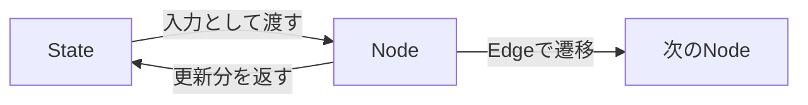
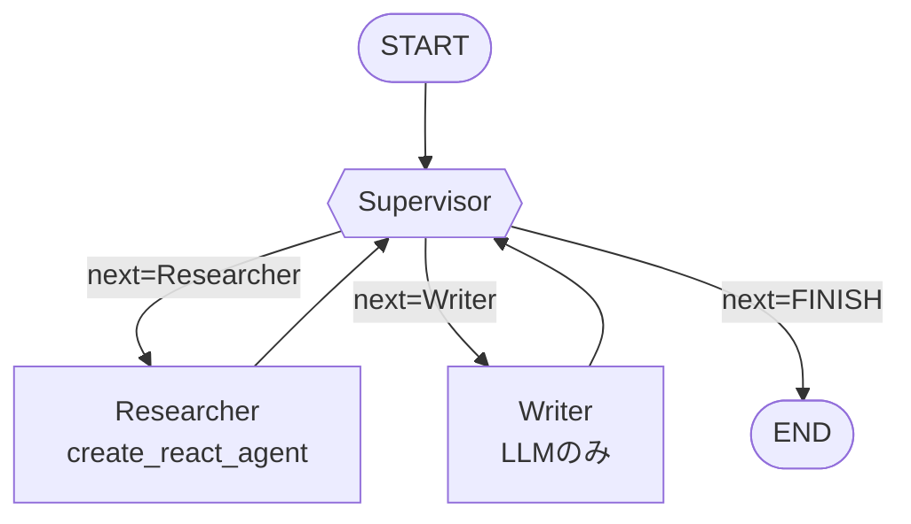
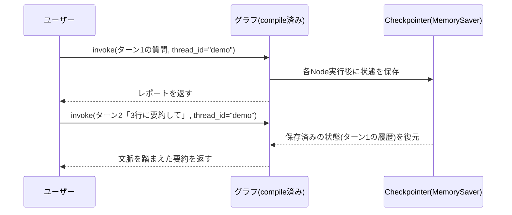
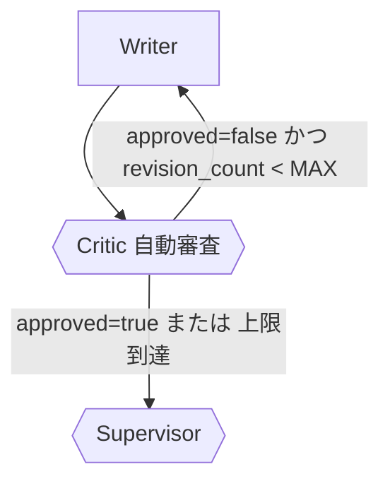
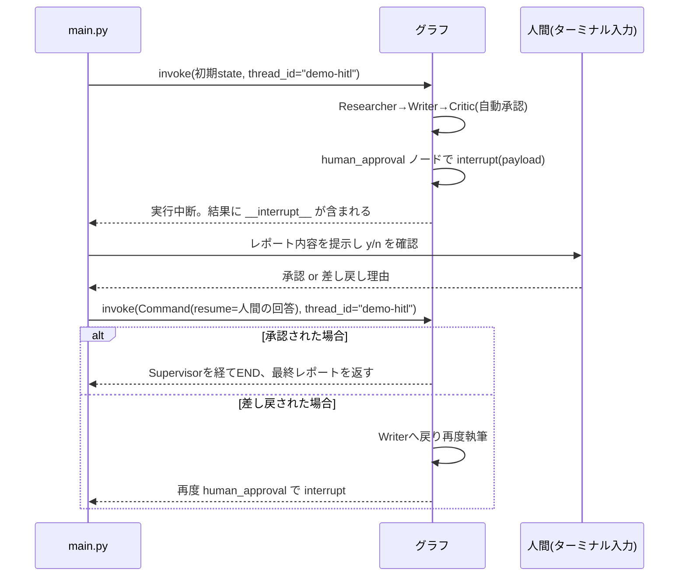

# TUTORIAL: 各Stepの解説

このドキュメントの目的は「動くコードを写経する」ことではなく、**各Stepで何が起きているかを理解し、
自分で公式ドキュメントを調べながら機能を拡張できるようになる**ことです。

各Stepの解説には、対応する公式ドキュメント(LangChain / LangGraph)へのリンクを載せています。
コードを読んで分からない部分があれば、まずそのリンク先を読みに行く癖をつけてください。

> 補足: LangChainのドキュメントは2025年に `docs.langchain.com` に統合されました。
> API仕様の詳細(引数・戻り値など)は `reference.langchain.com` にあるリファレンスを見るのが確実です。
> 概念や使い方のガイドは `docs.langchain.com`、関数/クラスの厳密な仕様は `reference.langchain.com`、
> と使い分けると調べ物が早くなります。

## ドキュメントの読み方(全Step共通)

| 知りたいこと | 見るべき場所 |
|---|---|
| LangGraphの基本概念(State/Node/Edge)を知りたい | [Graph API overview](https://docs.langchain.com/oss/python/langgraph/graph-api) |
| はじめの一歩を動かしたい | [LangGraph Quickstart](https://docs.langchain.com/oss/python/langgraph/quickstart) |
| `StateGraph`のメソッド一覧・引数を確認したい | [StateGraph リファレンス](https://reference.langchain.com/python/langgraph/graph/state/StateGraph) |
| 特定のクラス/関数の正確なシグネチャを調べたい | [LangChain Reference (reference.langchain.com)](https://reference.langchain.com/python/langgraph) |
| ソースコードを直接読みたい/Issueを検索したい | [langchain-ai/langgraph (GitHub)](https://github.com/langchain-ai/langgraph) |

---

## 共通概念: State / Node / Edge

LangGraphは全てのアプリケーションを「グラフ」としてモデル化します。

- **State**: グラフ全体で共有されるデータ構造。各Nodeはこれを受け取り、更新分を返す。
- **Node**: 実際の処理を行う関数(LLM呼び出し、ツール実行など)。
- **Edge**: Node間の遷移。固定の遷移と、条件によって行き先が変わる`条件付きEdge`がある。

参考: [Graph API overview](https://docs.langchain.com/oss/python/langgraph/graph-api)



---

## Step1: 単一エージェント + 検索ツール

**ファイル**: `step1_single_agent.py`

### 何をしているか

1. `State`を定義する。ここでは`messages`(会話履歴)だけを持つ最小構成。
   `Annotated[list, add_messages]`という書き方で、「新しいメッセージは上書きではなく追記する」
   という集約ルール(reducer)を指定している。
2. `llm.bind_tools(tools)`で、LLMが「検索ツールを呼び出す」という意思表示(tool_calls)を
   返せるようにする。
3. `agent`ノードはLLMを呼び出すだけ。ツールを呼ぶかどうかの判断はLLM自身が行う。
4. `tools_condition`という補助関数が、直前のAIメッセージに`tool_calls`が含まれているかを見て、
   「ツールノードに進むか」「終了するか」を自動判定する。
5. ツール実行後は必ず`agent`ノードに戻り、LLMがツールの結果を踏まえて次の応答を作る。

### グラフ構成


### 「ツールを使うか」を判断しているのは誰か

誤解しやすいポイントとして、**LangGraphが回答の中身を評価してツール呼び出しを決めているわけではありません**。
判断の主体はあくまでLLM(Claude)自身で、LangGraph側はその判断結果を機械的に読み取っているだけです。

判断が実際に発生する場所はコード上2箇所に分かれています。

```python
llm = ChatAnthropic(model="claude-sonnet-4-5-20250929", temperature=0)
llm_with_tools = llm.bind_tools(tools)          # ① ツールの存在をLLMに知らせる(設定のみ)

def agent_node(state: State) -> State:
    response = llm_with_tools.invoke(state["messages"])   # ② 実際に判断が行われる瞬間
    return {"messages": [response]}
```

- **① `bind_tools(tools)`**: 「このLLMはこのツール一式を使ってよい」と権限を与える設定。
  Anthropic APIへのリクエストに`tools`パラメータ(各ツールの名前・説明・引数スキーマ)が
  付与されるようになるだけで、この時点ではまだ判断は発生していない。
- **② `llm_with_tools.invoke(...)`**: `agent`ノードが実行されるたびに呼ばれる、実際のAPI呼び出し。
  ツール定義付きのリクエストを受け取ったClaudeが、会話履歴を見て「ツールを呼ぶべきか、
  このままテキストで答えるべきか」を毎回自動的に判断する。これはAnthropicのtool use機能自体の
  挙動であり、コード側に「判断してください」という明示的なプロンプト文は存在しない。

判断結果は`response.tool_calls`というフィールドに格納されて返ってくる。
`tools_condition`はこの`tool_calls`が空かどうかを見ているだけの**機械的な分岐**であり、
回答の正しさや品質を審査しているわけではない(品質チェックはStep4で登場するCriticの役割)。

### 何が起きているかを言葉で追うと

「質問を受け取る → LLMが『検索が必要』と判断しtool_callsを返す →
`tools_condition`が検索ツールを実行すべきと判定 → `ToolNode`が実際に検索APIを呼ぶ →
検索結果を含めて再度LLMを呼び出す → 十分な情報が揃ったのでtool_callsなしの最終回答を返す →
`tools_condition`がENDと判定して終了」というループです。

### このStepで参照すべきドキュメント

- [LangGraph Quickstart(ツール付きエージェントの作り方)](https://docs.langchain.com/oss/python/langgraph/quickstart)
- [Graph API overview](https://docs.langchain.com/oss/python/langgraph/graph-api)
- [StateGraph リファレンス](https://reference.langchain.com/python/langgraph/graph/state/StateGraph)
- [`tools_condition` リファレンス](https://reference.langchain.com/python/langgraph.prebuilt/tool_node/tools_condition)
- [`ChatAnthropic`(Claudeモデルの使い方)](https://docs.langchain.com/oss/python/integrations/chat/anthropic)

### 自分で調べて拡張してみる課題

- ツールを2つ以上(検索 + 計算など)にしたらグラフはどう変わるか、`ToolNode`のドキュメントで
  複数ツール時の挙動を確認してみる。
  → 実際に手を動かす課題: [`exercises/step1_ex1_calculator_tool.py`](./exercises/step1_ex1_calculator_tool.py)
- `bind_tools`の代わりに`tool_choice`を指定すると何が変わるか調べてみる。
  → 実際に手を動かす課題: [`exercises/step1_ex2_tool_choice.py`](./exercises/step1_ex2_tool_choice.py)

---

## Step2: Supervisorパターンでマルチエージェント化

**ファイル**: `step2_supervisor.py`

### 何をしているか

Step1では1つのエージェントが全部をこなしていましたが、Step2では役割を分割します。

- **Researcher**: 検索専門。Step1と同じReAct構成を`create_react_agent`という prebuilt 関数で
  再利用している(自分でグラフを書かなくても同等のものが手に入る)。
- **Writer**: ツールを持たず、会話履歴にある情報をもとにレポートを書くことに専念する。
- **Supervisor**: 「次にResearcherを動かすか、Writerを動かすか、それとも終了か」を
  **毎ターン判断する**ノード。判断結果は`with_structured_output(RouteDecision)`によって
  `Literal["Researcher", "Writer", "FINISH"]`という機械可読な形で返される。

自由文でLLMに「次は誰?」と聞くと表記ゆれで分岐が壊れやすいため、Pydanticモデルで
出力形式を固定しているのがポイントです。

### グラフ構成



### このStepで参照すべきドキュメント

- [Multi-agent: サブエージェント構成の作り方](https://docs.langchain.com/oss/python/langchain/multi-agent/subagents-personal-assistant)
- [LangGraph Multi-Agent Supervisor(ライブラリ版supervisor)](https://reference.langchain.com/python/langgraph-supervisor)
- [`create_react_agent`(prebuiltなReActエージェント)](https://reference.langchain.com/python/langgraph.prebuilt/chat_agent_executor/create_react_agent)
- [`with_structured_output`(Claudeでの構造化出力)](https://reference.langchain.com/python/langchain-anthropic/chat_models/ChatAnthropic/with_structured_output)

> **注意(API変化について)**: `langgraph.prebuilt.create_react_agent`は将来的に
> `langchain.agents.create_agent`への移行が案内されています。またサンプルで使っている
> `langchain_community.tools.tavily_search`も非推奨となり、`langchain-tavily`パッケージへの
> 移行が推奨されています([Tavily公式のLangChain連携ドキュメント](https://docs.tavily.com/documentation/integrations/langchain))。
> ライブラリは頻繁に更新されるため、実装前に必ずPyPIやリファレンスの最新ページで
> 非推奨(deprecated)表示がないか確認する習慣をつけてください。

### 自分で調べて拡張してみる課題

- `langgraph-supervisor`ライブラリ(`create_supervisor`)を使うと、自作したSupervisorノードが
  どれだけコードを削減できるか比較してみる。
- Researcherをもう1種類(例: 統計データ専門)増やし、Supervisorの分岐を3方向にしてみる。
  → 実際に手を動かす課題: [`exercises/step2_ex1_three_way_supervisor.py`](./exercises/step2_ex1_three_way_supervisor.py)(FactChecker版)

---

## Step3: メモリ永続化(会話の継続)

**ファイル**: `step3_memory.py`

### 何をしているか

Step2までは`graph.invoke()`を呼ぶたびに状態が空から始まっていました。実際のアプリでは
「さっきの続き」を扱えないと使い物になりません。

- `MemorySaver`という**Checkpointer**を`graph_builder.compile(checkpointer=memory)`のように
  渡すと、Nodeが実行されるたびに状態がスナップショットとして保存されます。
- 呼び出し時に`config={"configurable": {"thread_id": "..."}}`を指定することで、
  「どの会話(スレッド)の続きか」をLangGraphに伝えます。同じ`thread_id`で呼べば、
  直前の状態(メッセージ履歴など)が自動的に復元されます。

### 処理の流れ



### このStepで参照すべきドキュメント

- [Persistence(Checkpointer全般の解説)](https://docs.langchain.com/oss/python/langgraph/persistence)
- [`langgraph.checkpoint` リファレンス](https://reference.langchain.com/python/langgraph.checkpoint)

### 自分で調べて拡張してみる課題

- `MemorySaver`はプロセスを再起動すると消える。永続化したい場合に使う`SqliteSaver`/
  `PostgresSaver`のセットアップ方法をPersistenceドキュメントで調べてみる。
- 異なる`thread_id`を使うと会話がどう分離されるか、実際に動かして確認してみる。
  → 実際に手を動かす課題: [`exercises/step3_ex1_multi_thread.py`](./exercises/step3_ex1_multi_thread.py)

---

## Step4: Criticによる自己修正ループ

**ファイル**: `step4_critic_loop.py`

### 何をしているか

Writerが一度書いたレポートをそのまま出すのではなく、**Criticエージェントが自動でレビューし、
問題があれば差し戻す**ループを追加します。いわゆる「reflection(自己反省)パターン」です。

- Criticは`with_structured_output(CriticVerdict)`で`approved: bool`と`feedback: str`を返す。
- `approved=False`ならWriterに戻る。その際、Criticの指摘が会話履歴に追加されるので、
  Writerは次回そのフィードバックを踏まえて書き直せる。
- **重要**: LLM同士のループは条件次第で終わらなくなる可能性があるため、
  `revision_count`と`MAX_REVISIONS`で上限を設け、上限に達したら強制的に承認扱いにしている。
  これは自己修正ループを作る際にほぼ必須の安全装置です。

### グラフ構成(差分部分)



### このStepで参照すべきドキュメント

- [Graph API overview: 条件付きEdgeとループ](https://docs.langchain.com/oss/python/langgraph/graph-api)
- [`add_conditional_edges` リファレンス](https://reference.langchain.com/python/langgraph/graph/state/StateGraph/add_conditional_edges)
- [`with_structured_output`(Critic判定の構造化出力)](https://reference.langchain.com/python/langchain-anthropic/chat_models/ChatAnthropic/with_structured_output)

> ドキュメント内でも「決定的でないwhileループでinterrupt/ノード呼び出しを繰り返すのは避け、
> 条件付きEdgeで制御すること」が明示的に推奨されています。無限ループ・無限課金を防ぐ意味でも
> 上限回数のガードは省略しないでください。

### 自分で調べて拡張してみる課題

- `revision_count`をState全体で永続化(Step3のCheckpointerと組み合わせる)し、
  複数回のグラフ実行をまたいで上限を管理できるか試してみる。
  → 実際に手を動かす課題: [`exercises/step4_ex1_persistent_revision_count.py`](./exercises/step4_ex1_persistent_revision_count.py)
- Criticのfeedbackを`SystemMessage`ではなく専用のStateフィールドに分離し、
  Writerへの伝え方を変えてみる。

---

## Step5(最終): human-in-the-loop 承認フロー

**ファイル**: `step5_human_in_the_loop.py`

### 何をしているか

Criticの自動レビューを通過したレポートについて、最後に**人間が承認するかどうか**を
グラフの実行中に挟み込みます。

- ノードの中で`interrupt(payload)`を呼ぶと、その時点でグラフの実行が一時停止し、
  `payload`の内容とともに制御が呼び出し元(`main`)に返る。
- Checkpointer(Step3で導入した`MemorySaver`)があるおかげで、一時停止中の状態は
  失われずに保持される。
- 呼び出し元は人間の入力(承認/差し戻し理由)を受け取り、`graph.invoke(Command(resume=値), config)`
  のように**同じthread_idで**再開する。すると`interrupt()`の呼び出し箇所が、
  渡した値を戻り値として実行を続ける。

### 処理の流れ



### このStepで参照すべきドキュメント

- [Interrupts(human-in-the-loopの公式ガイド)](https://docs.langchain.com/oss/python/langgraph/interrupts)
- [`interrupt` リファレンス](https://reference.langchain.com/python/langgraph/types/interrupt)
- [Persistence(interruptの前提となるCheckpointerの仕組み)](https://docs.langchain.com/oss/python/langgraph/persistence)

### 自分で調べて拡張してみる課題

- `interrupt()`を1つのノードで2回以上呼ぶとどうなるか、Interruptsドキュメントの
  「複数回のinterrupt呼び出し」に関する注意点を読んで確認してみる。
  → 実際に手を動かす課題: [`exercises/step5_ex1_double_confirmation.py`](./exercises/step5_ex1_double_confirmation.py)
  (1ノード1interruptのルールを守りつつ二段階確認を実装する)
- ターミナル入力の代わりに、Slack通知やWebフォームからの入力で再開する構成に
  置き換えるとしたら、どこを変更すればよいか設計してみる(コードは書かなくてもOK)。

---

## 完成後、さらに学びを深めるには

このハンズオンで触れたのは「Graph API」「prebuiltエージェント」「Checkpointer」
「structured output」「interrupt」という、LangGraphの中核機能の一部です。次のステップとして:

1. [LangGraph Quickstart](https://docs.langchain.com/oss/python/langgraph/quickstart)から
   [Graph API overview](https://docs.langchain.com/oss/python/langgraph/graph-api)、
   [Persistence](https://docs.langchain.com/oss/python/langgraph/persistence)、
   [Interrupts](https://docs.langchain.com/oss/python/langgraph/interrupts)の順で
   公式ガイドを通しで読むと、このハンズオンで断片的に触れた概念が繋がります。
2. 分からない関数が出てきたら、まず[reference.langchain.com](https://reference.langchain.com/python/langgraph)
   で該当パッケージ(`langgraph`, `langgraph.prebuilt`, `langchain-anthropic`など)を検索する癖をつける。
3. [langchain-ai/langgraph](https://github.com/langchain-ai/langgraph)のGitHub Issuesは、
   ライブラリの仕様変更や非推奨(deprecation)の一次情報源として有用。エラーに詰まったら検索してみる。

README.mdの「この先の発展アイデア」も参考に、興味のある機能から自分で調べて実装してみてください。
